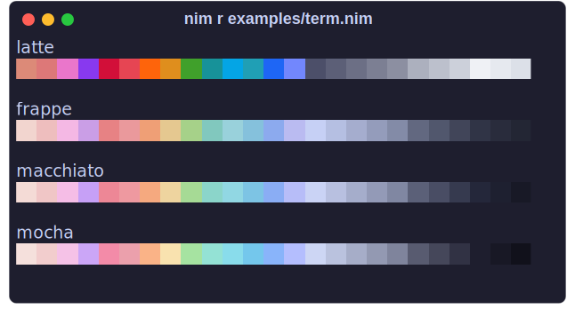

<h3 align="center">
	<br/>
	
	Catppuccin for <a href="https://github.com/catppuccin/nim">nim</a>
	
</h3>

<p align="center">
	<a href="https://github.com/catppuccin/nim/stargazers"></a>
	<a href="https://github.com/catppuccin/nim/issues"></a>
	<a href="https://github.com/catppuccin/nim/contributors"></a>
</p>


## Usage

```sh
nimble install https://github.com/catppuccin/nim
```

The `catppuccin` nim library was designed to interface with [`treeform/chroma`](https://github.com/treeform/chroma), however it is not required for basic usage. Some of the basic color types and transformations have been ported from `chroma`

If you do wish to access `catppuccin` colors alongside `chroma` compile with `-d:inheritChroma` (see `./examples/use_chroma.nim`) to use the color types defined by `chroma`.

### Examples

```nim
import catppuccin

echo mocha.rosewater.color().toHex()
```

Output of `nim r examples/term.nim`:




<!-- this section is optional -->
## 🙋 FAQ

-	Q: **_"Where can I find the doc?"_**\
	A: Run `nimble docs`

## 💝 Thanks to

- [daylinmorgan](https://github.com/daylinmorgan)

&nbsp;

<p align="center">
	
</p>

<p align="center">
	Copyright &copy; 2021-present <a href="https://github.com/catppuccin" target="_blank">Catppuccin Org</a>
</p>

<p align="center">
	<a href="https://github.com/catppuccin/catppuccin/blob/main/LICENSE"></a>
</p>
